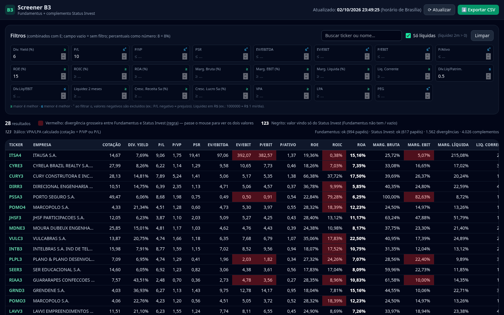

# Screener B3

Filtro de ações da B3 com indicadores fundamentalistas (P/L, P/VP, DY, ROE, ROIC, margens, EV/EBITDA, dívida, VPA, LPA e outros).



## Fontes de dados
- **Fundamentus** (principal): tabela geral com todas as ações em uma única requisição.
- **Status Invest** (complemento): preenche apenas o que o Fundamentus não tem.
- **brapi.dev** (opcional): nomes e setores das empresas.

Nenhuma das fontes exige token. Fundamentus e Status Invest não têm API oficial; os dados são lidos dos sites e podem mudar se os sites mudarem.

## Legenda
- **Vermelho**: divergência grosseira entre Fundamentus e Status Invest (passe o mouse para ver os dois valores).
- **Negrito**: valor vindo só do Status Invest.
- *Itálico*: VPA/LPA calculado (preço ÷ P/VP ou preço ÷ P/L).

## Filtros inteligentes
Os filtros funcionam em conjunto. Para indicadores em que "mais é melhor" (DY, ROE, ROIC, margens...) o valor digitado vale como **≥**; para "menos é melhor" (P/L, P/VP, EV/EBITDA, dívida...) vale como **≤**. Percentuais são digitados como número (8 = 8%).

## Rodar localmente
```bash
./run.sh
# abra http://localhost:8000
```
Ou manualmente:
```bash
pip install -r requirements.txt
uvicorn server:app --port 8000
```

## Publicar online
O app tem backend em Python, então **não roda no GitHub Pages**. Para ter um link público, conecte este repositório a um serviço como [Render](https://render.com) ou [Railway](https://railway.app):
- Build: `pip install -r requirements.txt`
- Start: `uvicorn server:app --host 0.0.0.0 --port $PORT`

Os dados ficam em cache e são atualizados a cada 30 minutos (ou pelo botão "Atualizar").

## Status Invest bloqueado (HTTP 403) no servidor

O Status Invest pode bloquear IPs de datacenter (ex.: Render). O servidor tenta, em ordem:
1. **Ao vivo**: export CSV e depois o endpoint JSON paginado, com headers de navegador e cookies de sessão.
2. **Snapshot do GitHub Actions**: o workflow `.github/workflows/statusinvest.yml` roda em dias úteis às 19:30 (BRT)
   e sob demanda (`workflow_dispatch`), gravando `data/statusinvest.csv` na branch **`data`** (não na `main`,
   para não disparar deploy no Render). O servidor lê de `raw.githubusercontent.com` (variável `SI_FALLBACK_URL`).
3. **Arquivo local** `data/statusinvest.csv` versionado na `main`.

A fonte usada e a data do snapshot aparecem em `/api/status` → `status.statusinvest`.

## Desempate com 3ª fonte (yfinance)

Para células em **vermelho** (divergência grosseira Fundamentus × Status Invest), o servidor consulta o Yahoo
(`yfinance`, `Ticker('XXXX.SA').info`) **só para os tickers com divergência**, em thread de fundo (sequencial,
pausa + retries, cache em disco de 24 h). Se o par mais próximo entre as três fontes não diverge grosseiramente,
a célula fica **âmbar "2/3"** e o valor da fonte confirmada é usado em filtros e ordenação; senão continua vermelha.
Mapeamento: P/L=trailingPE, P/VP=priceToBook, PSR=priceToSalesTrailing12Months, DY=trailingAnnualDividendYield×100,
ROE/ROA=returnOnEquity/returnOnAssets×100, Marg. bruta/EBIT/líquida=grossMargins/operatingMargins/profitMargins×100,
EV/EBITDA=enterpriseToEbitda, Liq. corrente=currentRatio, VPA=bookValue, LPA=trailingEps, Cotação=currentPrice.
Sem 3ª fonte: ROIC, EV/EBIT, P/EBIT, P/Ativo, Dív.Líq/Patrim., crescimentos 5a.
Se o Yahoo bloquear o servidor, usa o snapshot `data/yfinance.json` da branch `data`
(gerado por `scripts/fetch_yfinance.py`, chamado por `scripts/push_snapshot_from_here.sh`).

## Multi-fonte, consenso, seletor de fonte e de país
| Fonte | Como chega ao Render | Países |
|---|---|---|
| Fundamentus | ao vivo | BR |
| Status Invest | ao vivo → snapshot (branch `data`) se 403 | BR |
| TradingView (scanner) | ao vivo em lote → snapshot `tradingview_<país>.json` se bloquear | BR, EUA, Reino Unido, Alemanha, Portugal, Japão |
| Investidor10 | snapshot diário (raspado da máquina da rotina, ~1 req/s) | BR |
| Dados de Mercado | snapshot diário (EBIT padrão e **ajustado**) | BR |
| CVM dados abertos (DFP/ITR) | snapshot diário pré-processado (`scripts/build_cvm.py` → `cvm.json`) | BR |
| Yahoo (yfinance) | ao vivo em 2º plano → snapshot | BR (só tickers com divergência) |

**Consenso ("Todos")**: por indicador, o maior grupo de fontes que concordam entre si (todos os pares dentro da regra de divergência).
Maioria = mais da metade das fontes com valor. Exibe o Fundamentus se ele estiver no grupo; senão a mediana do grupo.
Vermelho = sem maioria; âmbar = maioria com discordância (n/m); azul **aj** = o Fundamentus usa EBIT ajustado
(lucro bruto − despesas de vendas − G&A, confirmado pela CVM/Dados de Mercado) e diverge só por definição.
Selecionar uma fonte mostra somente os valores dela (filtros e ordenação usam esses valores; sem dado = —).

Rotina diária (19:05): `scripts/push_snapshot_from_here.sh` atualiza todos os snapshots em sequência
(`ONLY="cvm tradingview"` limita as etapas).
